# Тестування працездатності системи

## Запуск серверу

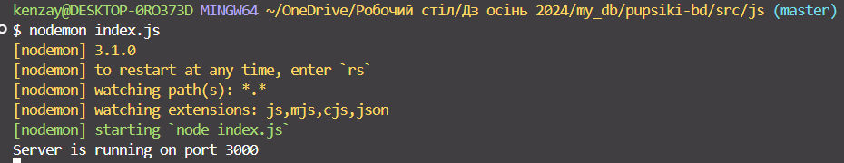

## Метод GET

### GET ALL

#### Запит

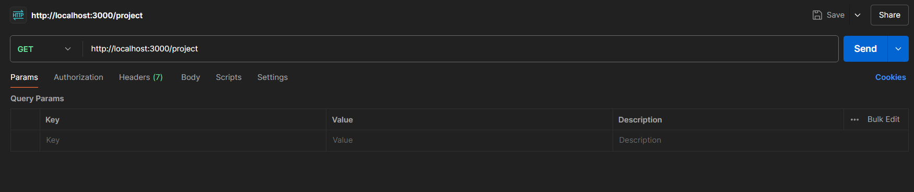

#### Відповідь

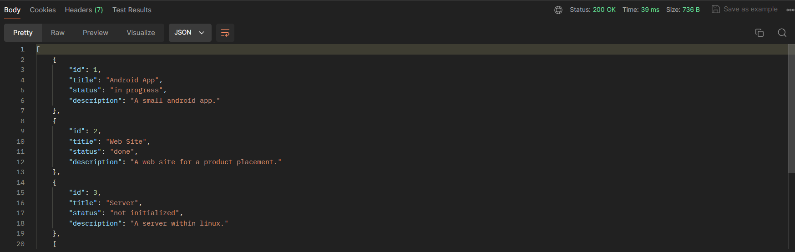

### GET BY ID

#### Запит

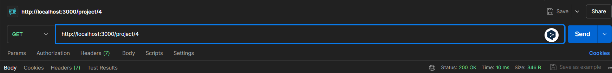

#### Відповідь

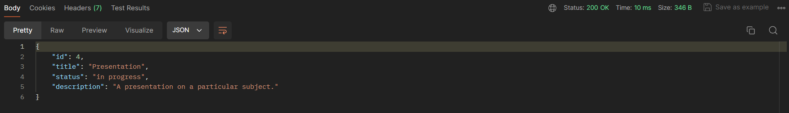

## Метод POST

#### Запит

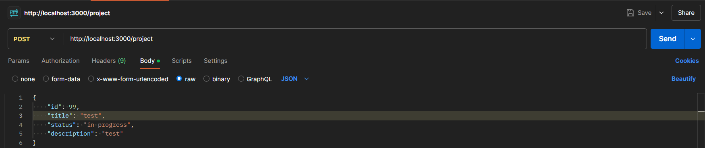

#### Відповідь

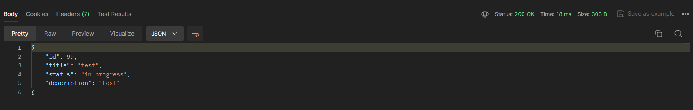

_(демонструю через GET)_

## Метод PATCH

#### Запит

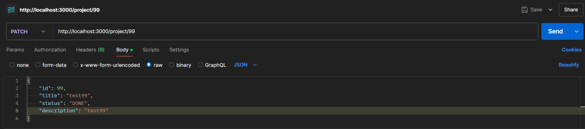

#### Відповідь

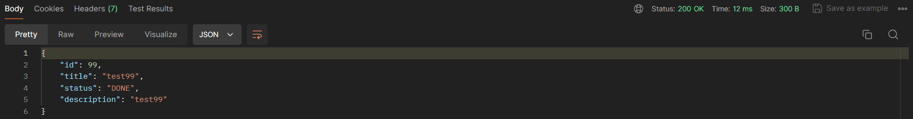

_(демонструю через GET)_

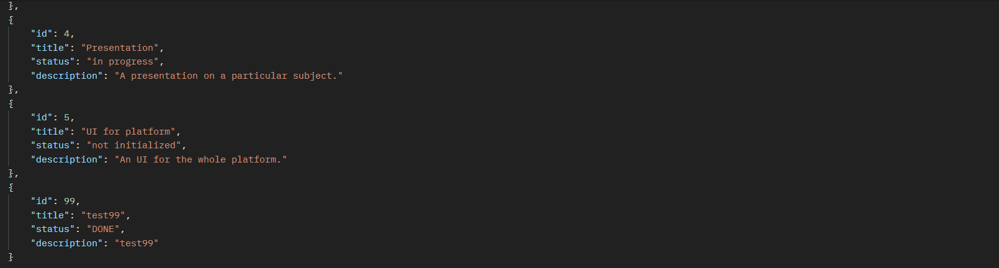

## Метод DELETE

#### Запит

#### Відповідь

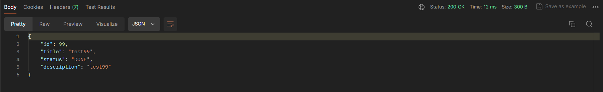

_(демонструю через GET id)_

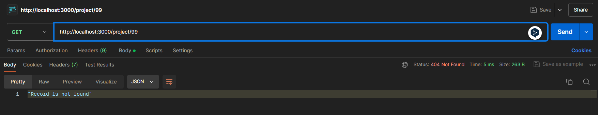
