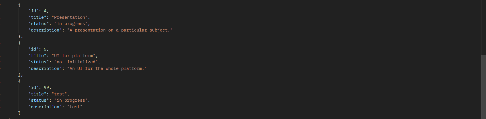

# Тестування працездатності системи

## Запуск серверу

## Метод GET

### GET ALL

#### Запит

#### Відповідь

### GET BY ID

#### Запит

#### Відповідь

## Метод POST

#### Запит

#### Відповідь

_(демонструю через GET)_

## Метод PATCH

#### Запит

#### Відповідь

_(демонструю через GET)_

## Метод DELETE

#### Запит

#### Відповідь

_(демонструю через GET id)_

